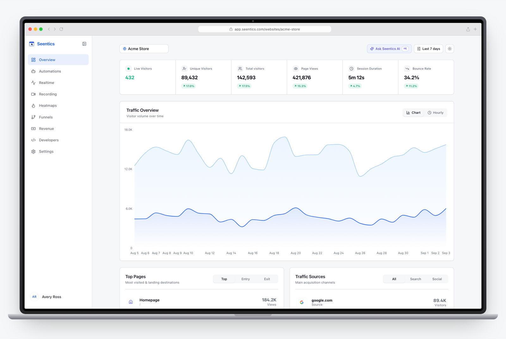

<p align="center">
  
</p>

<h1 align="center">Seentics</h1>

<p align="center">
  Open-source, privacy-first web analytics — real-time dashboards, session replays,<br />
  heatmaps, funnels, revenue tracking, behavioral automations, and natural-language queries.
</p>

<p align="center">
  <a href="#quick-start">Quick Start</a> ·
  <a href="#tracking">Tracking</a> ·
  <a href="#project-layout">Layout</a> ·
  <a href="#contributing">Contributing</a> ·
  <a href="DEPLOYMENT.md">Deployment</a>
</p>

<p align="center">
  <picture>
    <source media="(prefers-color-scheme: dark)" srcset="web/public/assets/dashboard-dark.png" />
    
  </picture>
</p>

<p align="center">
  <em>Try it at <a href="https://seentics.com/websites/demo">seentics.com/websites/demo</a> — no account needed.</em>
</p>

---

Self-hosted analytics without cookies, fingerprinting, or third-party data sharing.
Your data stays on your infrastructure.

## Features

- **Real-time analytics** — live visitor map, active pages, traffic as it happens
- **Behavioral automations** — modals, banners, webhooks and redirects from behaviour
- **Session replays** — full recordings with rage-click and JS error detection
- **Heatmaps** — click maps, scroll depth, captured page screenshots
- **Funnels** — multi-step conversion analysis with drop-off rates
- **Revenue** — orders, AOV, ARPU, UTM channel attribution
- **Events and goals** — page, event or CSS-selector conversions
- **Seentics AI** — ask questions in plain English, get charts back (`⌘K`)

## Quick Start

```bash
git clone https://github.com/Seentics/seentics.git
cd seentics
docker compose up -d --build
```

Brings up PostgreSQL, MinIO, the API on `:8080` and the dashboard on `:3000`.
Create a website in the dashboard, then add the tracking script below.

For production, see [DEPLOYMENT.md](DEPLOYMENT.md).

## Tracking

To test real tracking across the full OSS stack, see [Session recording E2E](web/e2e/recording/README.md)
or [Heatmap E2E](web/e2e/heatmap/README.md). From `web/`, run `npm run test:e2e:recording`
or `npm run test:e2e:heatmap`; each creates an isolated test stack and removes its disposable data afterward.

Add to your `<head>`:

```html
<script
  defer
  src="https://your-seentics-domain.com/trackers/seentics.js"
  data-website-id="YOUR_WEBSITE_ID"
></script>
```

Pageviews, scroll depth, exit intent and rage clicks are captured automatically.
`YOUR_WEBSITE_ID` is the id shown on your website's settings page.

### JavaScript API

```javascript
// Custom event, with optional properties
seentics.track('signup_click');
seentics.track('purchase', { value: 49.99, currency: 'USD', order_id: 'ORD-1234' });

// Identify a visitor. Note the argument order: id first, then traits.
seentics.identify('user_123', { email: 'user@example.com', plan: 'pro' });

seentics.page();   // manual pageview, if auto-tracking is off
seentics.flush();  // send queued events immediately
```

Revenue reporting keys off `value` and `currency` on any event; goals are configured
in the dashboard rather than in code.

## Project Layout

```
seentics/
├── core/            Bun + Hono API — a modular monolith
│   ├── app/         Composition root, where the graph is wired
│   ├── modules/     Domain modules, one table each
│   ├── platform/    Cross-cutting; owns no table
│   ├── infrastructure/  Event bus, transactional outbox
│   └── db/          Drizzle schema and migrations
├── web/             Next.js dashboard, plus public/trackers/seentics.js
└── ui/blocks/       @seentics/ui — embeddable React blocks (MIT)
```

Modules talk to each other through explicit interfaces for synchronous calls and
typed domain events for asynchronous ones. **Read
[core/ARCHITECTURE.md](core/ARCHITECTURE.md) before changing `core/`** — it covers the
module boundaries, the event bus guarantees, and the known gaps.

## Architecture

```
Browser ──┬─ tracker ──▶ POST /api/v1/tracker/collect ─┐
          └─ dashboard ─▶ Next.js :3000 ───────────────┤
                                                        ▼
                                              Bun API :8080
                                                 │        │
                                          PostgreSQL   S3 / MinIO
                                        (events, meta) (replays, heatmaps)
```

Tracker events are buffered in memory and flushed in batches, so `/collect` returns
without waiting on the database. Replay chunks and heatmap screenshots go to
S3-compatible storage.

| Layer | Stack |
|---|---|
| API | Bun · Hono · Drizzle ORM |
| Dashboard | Next.js 15 · Tailwind · shadcn/ui |
| Data | PostgreSQL 16 · S3-compatible object storage |
| Replays | rrweb |

## Contributing

```bash
cd core
bun install
bun run check   # typecheck — expected to be clean
bun test        # ~630 tests, no database or S3 required
bun run dev
```

CI runs `check` and `test` on every pull request, and both are expected to pass.
Tests use in-memory doubles of the module interfaces, so no services are needed.

Two things worth knowing before you write tests: `mock.module` is process-global in
Bun, so an incomplete stub becomes the real module for every later test file — make
stubs complete. And `core/ARCHITECTURE.md` lists the current known gaps if you are
looking for something to pick up.

See [CONTRIBUTING.md](CONTRIBUTING.md) for the PR process.

## License

[GNU AGPL v3.0](LICENSE) — self-host freely; modifications must be released under
the same license. The [`@seentics/ui`](ui/blocks) package is separately
[MIT](ui/blocks/LICENSE).

---

<p align="center">
  Built by the <a href="https://github.com/Seentics">Seentics</a> team ·
  <a href="https://github.com/Seentics/seentics/issues">Report an issue</a>
</p>
